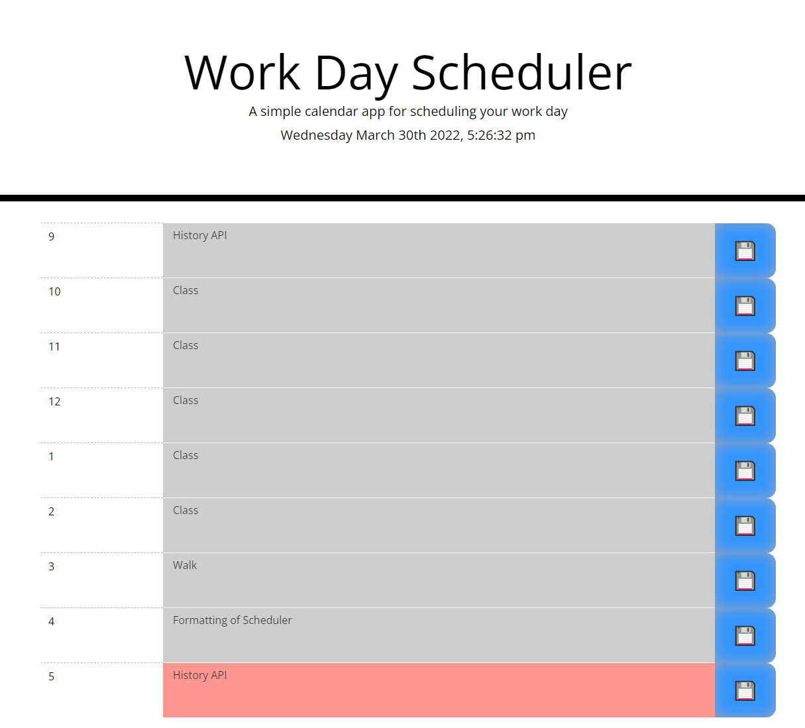

# Workday Scheduler

## Summary

This web app is a workday scheduler that allows you to save items in hour blocks for your current workday.

## Details

- Utilizes the following 3rd party resources: Moment.js, Bootstrap, and jQuery
- Displays current time.
- Displays rows for each hour of workday.
- User can enter in items for each workday and save these items in the local storage (using a save button) so that they are rendered on reload.
- Color of hour block is determined by whether past, present or future

## Screenshots

## Live Site

https://joechristianson.github.io/WorkdayScheduler/